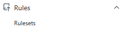
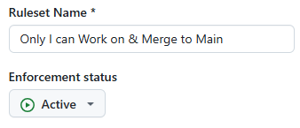
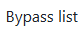
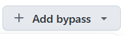
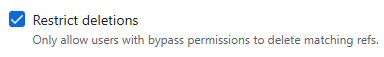
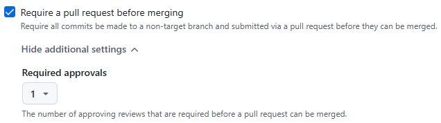
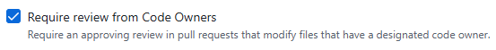
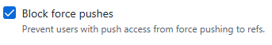

# GitHub

## Setup Ruleset to Protect Main Branch

- Create a CODEOWNERS file in a .github folder in your repository listing your GitHub name as follows:

  \# Jeremy must review changes before they are merged into master.

  \* @JmmonJeremy

  \# Only Jeremy can approve a change to this ownership policy.
 
  \/.github/CODEOWNERS @JmmonJeremy

- While in the repository click on Settings

  
- Click on the Rules drop-down arrow & select Rulesets

  
- Enter a Ruleset Name & change Enforcement status to Active

  
- Add Repository admin Role to Bypass list

 

- Set Target branches to main branch name or Default

  
- Select the following rules

  
  
  
  
- Save the ruleset

  

## Reviewing and approving pull requests

- Click the PR you want to review
- 

Show all local and remote branches: git branch -a
Switch to the remote branch for testing: 
git switch name-of-new-branch
or
git checkout name-of-new-branch

??? --track origin/cursor/customer-view-wireframe-884c