# GitHub

## Setup Ruleset to Protect Main Branch

- Create a CODEOWNERS file in a .github folder in your repository listing your GitHub name as follows:  

  \# Jeremy must review changes before they are merged into master.  
  \* @JmmonJeremy

  \# Only Jeremy can approve a change to this ownership policy.   
  \/.github/CODEOWNERS @JmmonJeremy

- While in the repository click on Settings  
    
- Click on the Rules drop-down arrow & select Rulesets  
  
- Enter a Ruleset Name & change Enforcement status to Active  
  
- Add Repository admin Role to Bypass list  
   

- Set Target branches to main branch name or Default  
  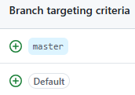
- Select the following rules  
    
    
    
    
- Save the ruleset  
    

## Reviewing and approving pull requests

- Click on Pull requests link  
  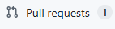
- Click the PR you want to review  
  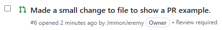
- Click on the Files changed link  
  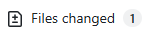  
- Look at each file and check the Viewed box  
  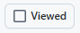
  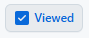  
- Test the features locally using VS Code & its terminal
  - Show all local and remote branches: 
    - git branch -a
      - Local branches appear without remotes/origin/.
      - GitHub branches appear with remotes/origin/.
  - If branch already exists locally, switch to the branch & get changes for testing with the following commands: 
    - git switch name-of-new-branch  
&nbsp;&nbsp;&nbsp;&nbsp;&nbsp;or 
    - git checkout name-of-new-branch    
    - git pull  
  - If branch is only in GitHub, switch to the remote branch for testing with the following commands:  
    - git switch --track origin/name-of-new-branch  
&nbsp;&nbsp;&nbsp;&nbsp;&nbsp;or  
    - git checkout --track origin/name-of-new-branch   
- Click on the Submit review drop-down arrow  
  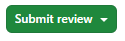  
- Make a comment,select Approve, and Submit review if good  
    
  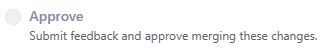  
  

# Cursor
## Separate Cursor Identity Overview
### Goal:  
- My account = Owner/Admin, can approve/merge
- Cursor account/token = Write access, can push branches, cannot bypass main  
### Workflow:
- Cursor pushes branch → Pull Request → I approve → I merge into main

## Create a separate GitHub account for a separate identity for Cursor to use  
- Use Incognito tab, go to github.com, & click on the Sign up button  
    
- Use a separate email & password and give it a name like jeremy-ai-work  
  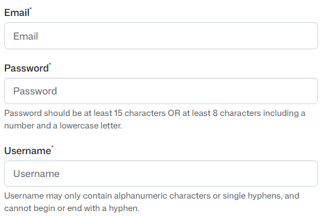  
- Deselect GitHub Copilot & click on the Create account button  
  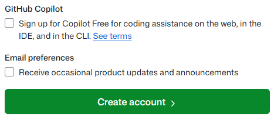  
- Do not create a new repository in the new for account Cursor

## Add the GitHub account for Curso to the repo as a collaborator with Write access
- In your regular GitHub account, in the repository you want Cursor working on, go to Settings  
  
- Under the Access section click on the Collaborators link  
  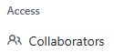  
- Across from the 'Manage access' title click on the 'Add people' button  
  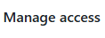
  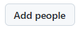  
- Add the username that was setup for Cursor's GitHub account & click on the Invite collaborator pop-up   
  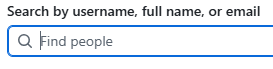
  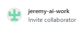
- Click the Add button after the match is found  
  
- In the new Cursor GitHub account click on the new notification icon  
  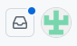  
- Open the invitation and accept it  
  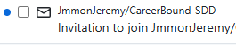  
  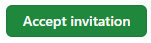 
- Click the profile picture in the top right & click Settings  
  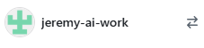  
  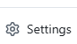  
- Scroll to the bottom of the left sidebar and click Developer settings  
  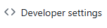
- Click the Personal access tokens drop-down button and select Tokens (classic)  
  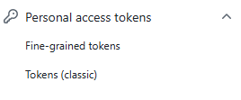  
- Click on the Generate new token drop-down and select Generate new token (classic)  
  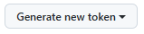  
  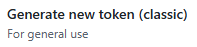
- Give it a name like Cursor Home-Gig Git access, set the Expiration as desired, and under Select scopes, check repo  
  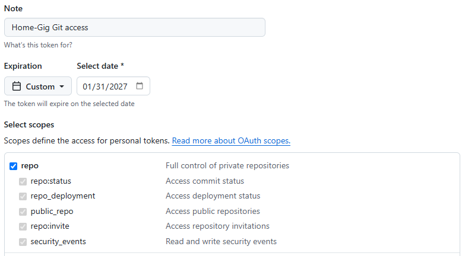  
- Click the Generate token button 
  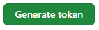  
- Immediately copy and record the token for use (keep the token private in the backend's .env file)
  - NOTE - after you leave the page you will not be shown the token again!!! 

## Have Cursor Desktop Use its Separate GitHub Account with a Clone of the Repository
- Open the downloaded version of Cursor and Clone the repository by clicking on the clone button  
  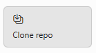  
  &nbsp;&nbsp;&nbsp;&nbsp;&nbsp;or 
- In Powershell go to the folder where you want to keep projects and run the following command to clone the repository
  - git clone https://github.com/JmmonJeremy/Home-Gig.git name-for-Cursor-clone-of-repository  
  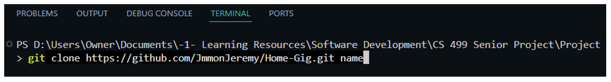  
- In Cursor open the cloned project by clicking on the Open project button and selecting the cloned project file  
  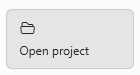
- Open the Terminal in Cursor by clicking on the Terminal heading and selecting New Terminal   
  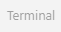  
- Set the repository’s remote URL to use jeremy-ai-work as the optional username portion before @ with the following command
  - git remote set-url origin https://jeremy-ai-work@github.com/JmmonJeremy/Home-Gig.git 
- To have Git Credential Manager include the repository path when looking up credentials with the following command
  - git config --local credential.useHttpPath true 
- In the terminal configure git to be using Cursors GitHub account by running the following commands in the terminal
  - git config --local credential.username jeremy-ai-work
  - git config --local user.name "jeremy-ai-work"
  - git config --local user.email "jeremy-ai-work email for GITHUB ACCOUNT" 
- Create a new branch and switch to that branch with the following command
  - git checkout -b cursor/next-feature-1 
- Verify you are on the new branch with the following command
  - git branch 
- Create a simple file in the Home-Gig-Cursor folder like cursor-auth-test.txt and add the following into the file
  - Testing GitHub authentication for the Cursor account. 
- Add, commit, and push the test file to attempt to have Git Credential Manager ask for credentials with the following commands  
  - git add cursor-auth-test.txt  
  - git commit -m "Test Cursor GitHub authentication"
  - git push -u origin cursor/next-feature-1
- When Git Credential Manager asks for credentials reply with the following
  - Username: jeremy-ai-work
  - Password: Cursor classic token 
- If Git Credential Manager does not ask for credentials then Open Windows Credential Manager using the following path
  - Control Panel → Credential Manager → Windows Credentials → Generic Credentials
- Remove only the GitHub credential that Git is currently using for github.com / this repository.
- Make a small change to the test file and commit, and push the test file to have GitHub ask for credentials with the following commands 
  - git commit -m "Test Cursor GitHub authentication 2nd attempt"
  - git push -u origin cursor/next-feature-1
- When Git Credential Manager asks for credentials reply with the following
  - Username: jeremy-ai-work
  - Password: Cursor classic token 
- After Cursor is setup with its own credentials then delete the file, commit the change, and push the deletion to clean things up with the following commands  
  - git rm cursor-auth-test.txt  
  - git commit -m "Remove authentication test file"
  - git push
- Set Cursor up to have the cloned Home-Gig-Cursor repository file have its own GitHub CLI login for pull requests
 - Open a terminal in the cloned repository folder - for example the terminal path ends with ...\Home-Gig-Cursor
 - At the root of cloned repository folder, ie. Home-Gig-Cursor, create a file named while in the master branch start-cursor-gh.ps1
 - In the start-cursor-gh.ps1 file, add the following content:  
   - $env:GH_CONFIG_DIR = "$PSScriptRoot\.gh-config"
   - gh auth status 
 - In your original local repository, ie. the Home-Gig folder .gitignore file, add the following content:
   - \# Local GitHub CLI configs for AI tool clones  
   - .gh-config/
   - start-cursor-gh.ps1
- In the cloned repository folder, ie. Home-Gig-Cursor, pull the change to the .gitignore file while in the master branch
- To setup a separate GitHub CLI config folder for Cursor's repository, in its terminal, ie. showing Home-Gig-Cursor run the following command
  - .\start-cursor-gh.ps1  
    - The first time, it will say "You are not logged into any GitHub hosts"
    - To do a one-time log in with approved GitHub CLI authorization enter the command
      - gh auth login 
      - Choose:
        - GitHub.com
        - HTTPS
        - Authenticate with a web browser
      - When the browser opens, sign in as:
        - GitHub username for Cursor, ie. jeremy-ai-work
      - Approve the GitHub CLI authorization
- Verify the Cursor login with the following command
  - gh auth status    
  - If done correctly the results should indicate:
    - Logged in to github.com account jeremy-ai-work
    - Active account: true    
- In the cloned repository folder, ie. Home-Gig-Cursor, switch back to a feature branch, to ensure no other work is done on the master branch.

## Giving Cursor Directions

- Tell Cursor to do or follow the following:  
  - start from master and pull the latest changes from origin/master  
  - create and work on a new branch with the name you want   
  - confirm it is working on the Git feature branch you want  
  - only to work on what you want it to change on that branch  
  - the clear goal for the assignment  
  - commit with a clear commit message  
  - push the changes to the Cursor feature branch  
  - before using any gh command, run .\start-cursor-gh.ps1  
  - confirm that jeremy-ai-work is the active account before creating or updating a pull request  
  - create a pull request into the master branch  
  - do not merge the pull request or bypass repository rules  
- Upload any images or PDFs that will help or reference them in the repository  

## Cursor Directions &nbsp; &nbsp; ⟹ &nbsp; &nbsp; Template Guide to Follow :

Create and work on a new branch named cursor/ThingBeingDone-feature. Like: cursor/searchbar-feature

Before changing anything:  

1. Start from master.  
2. Pull the latest changes from origin/master.  
3. Create or switch to the branch cursor/searchbar-feature from the updated master.  
4. Confirm the current Git branch is cursor/searchbar-feature.
5. Inspect the documents you specify to give guidance. 
6. Tell me which files you plan to change before editing & don't proceed until I tell you to continue. 

Goal:  
Give the clear purpose of the work. Like:  
Make the existing top-header search bar functional across the app.

Important Guidelines:  

- Do not perform refactoring, formatting-only changes, dependency updates, or cleanup outside the files required for this task. 
- If the wireframe or requirements are ambiguous, stop and ask for clarification instead of making assumptions. 
- Before committing, explain the reasoning behind each significant code change so I can understand what was modified and why.

Functional requirements:  

List the functional requirements desired. Like:  

   
* Product & Inventory Management page: search/filter by Product, Inventory, or Price fields if available.  
* Customer Management page: search/filter by Customer, Phone Number, Email, or Notes fields if available.  
* Orders & Payment Management page: search/filter by Order #, Customer, Order Date, Order Summary, Payment Status, or Payment Date fields if available.  

List for Special Behaviors. Like:  

Dashboard & Spreadsheet Export & Reporting pages search behavior:   

* When the user clicks inside the Dashboard search bar, show a dropdown list of searchable categories/pages, such as Products, Customers, Orders, and Reports.
* When the user selects a category/page, navigate to that page.
* After navigation, place the cursor/focus in the search bar.
* Carry the search text to that destination page if text was already typed, and perform the search there.
* If no text was typed yet, just navigate and focus the search bar on the selected page.

Design requirements: 

List the design requirements desired. Like:  

* Keep the existing header layout and visual style.
* Do not redesign the header.
* Use Bootstrap as much as possible.
* Make the search behavior usable on desktop and mobile.

Code requirements:  

List the code requirements desired. Like:  

* Use the existing Angular project conventions.
* Do not change authentication logic.
* Do not change backend code unless absolutely necessary.
* Do not change unrelated files.
* Avoid over-engineering; prefer simple frontend filtering if it fits the current app.

After implementation:  

1. Run the relevant build/test command.
2. Summarize the changed files.
3. Summarize how search works on each page.
4. Commit the completed changes with a clear commit message.
5. Push the changes to cursor/searchbar-feature.

Before using any gh command:  

1. Run: .\start-cursor-gh.ps1  
2. Then run: gh auth status  
3. Confirm that jeremy-ai-work is the active account before creating or updating a pull request.  

Then:  

1. Create a pull request from cursor/searchbar-feature into master.
2. Do not merge the pull request or bypass repository rules.
3. Return the pull request URL when finished.

## Copy & Paste Styling Directions &nbsp; &nbsp; ⟹ &nbsp; &nbsp; Template for Cursor or Codex :
Home Gig - Mobile Reports View
Important Guidelines
1. Do not perform refactoring, formatting-only changes, dependency updates, or cleanup outside the files required for this task.
2. If the wireframe or requirements are ambiguous, stop and ask for clarification instead of making assumptions.
3. Before committing, explain the reasoning behind each significant code change so I can understand what was modified and why. 

Git Setup
1. Start from the local master branch.
2. Pull the latest changes from origin/master.
3. Create and switch to a new branch named: codex/mobileReports-view
4. Confirm the current Git branch is: codex/mobileReports-view

Before Making Any Changes
1. Inspect the following files before editing anything:
docs/wireframes/6.1_Spreadsheet_Export_&_Reporting_Mobile_Wireframe.png
docs/Home_Gig_Requirements_Specification.docx
2. If docs/Home_Gig_Requirements_Specification.docx is too large or difficult to parse, use the wireframe as the primary visual source and report what parts of the requirements file could not be read.
3. Then inspect the current Reports implementation and identify every file that would need to change.
4. If any file other than reports.css and reports.html needs to be modified:
    Stop.
    1. List every file you believe needs to change.
    2. Explain why each file needs to change.
    3. Wait for my approval before making any edits.
    4. Do not begin editing until I explicitly tell you to continue.

Goal
Update only the mobile view of the Reports page so that it matches the supplied mobile wireframe as closely as practical. The desktop Reports view must remain visually and functionally unchanged.

Design Requirements
1. Follow the supplied wireframe.
2. Preserve the existing visual style.
3. Do not redesign the application.
4. Reuse the existing colors, typography, spacing, icons, and components whenever possible.
5. Use Bootstrap utility classes and responsive classes whenever practical instead of custom CSS.
6. Prefer responsive Bootstrap classes over media-query-heavy custom CSS.
7. Only add custom CSS when Bootstrap cannot accomplish the layout.
8. Do not introduce new UI libraries.

Functional Requirements
1. The page should function exactly as it currently does.
2. Do not: change routing, change navigation behavior, change authentication, change business logic, change API calls, change backend code
3. Only adjust the responsive presentation of the Reports page.

Code Requirements
1. Follow the existing Angular project conventions.
2. Keep the code consistent with the rest of the project.
3. Make the smallest changes necessary.
4. Do not: rename files, move files, modify unrelated files.
5. Do not create new components unless absolutely necessary.
6. Remove any unused code you introduce.
7. Do not leave commented-out code.

Validation
After implementation:
1. Run the appropriate Angular build.
2. Verify there are no build errors.
3. Verify the desktop Reports page still appears unchanged.
4. Verify the mobile Reports page matches the supplied wireframe as closely as practical.

Deliverables
Provide:
1. a summary of every changed file
2. a summary of the changes made
3. any assumptions or compromises that were necessary
4. confirmation that the desktop layout was preserved
5. confirmation that the application builds successfully 

Git
1. Commit the completed work using a descriptive commit message.
2. Push the branch: codex/mobileReports-view

GitHub Authentication
1. Before using any gh command, run: .\start-codex-gh.ps1
2. Then verify that the active GitHub account is: jeremy-ai-work
3. If it is not, stop and report the problem.

Pull Request
1. Create a pull request from: codex/mobileReports-view into: master
2. Do not merge the pull request.
3. Do not bypass any repository rules.
4. Return the pull request URL when finished.
